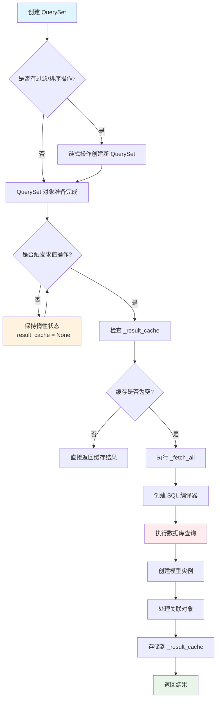
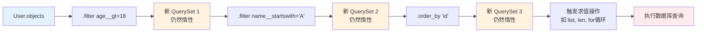
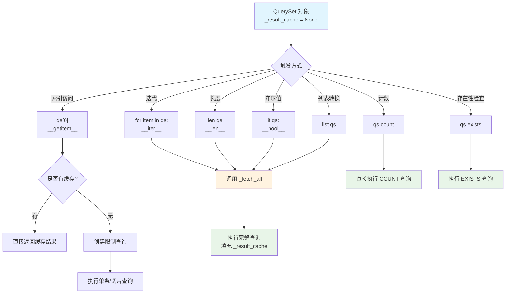
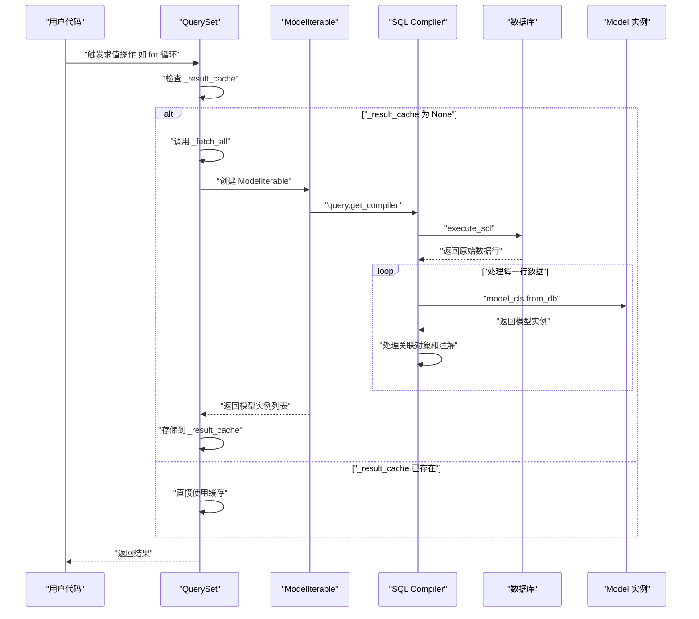
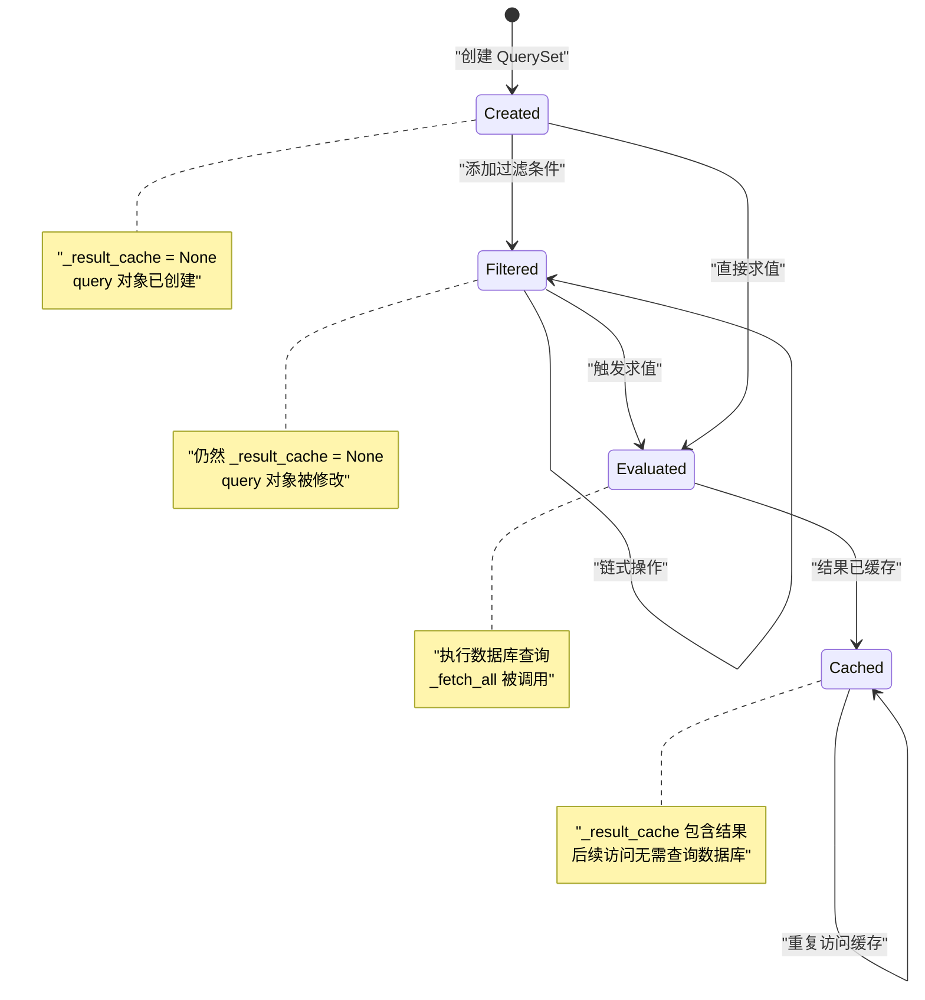
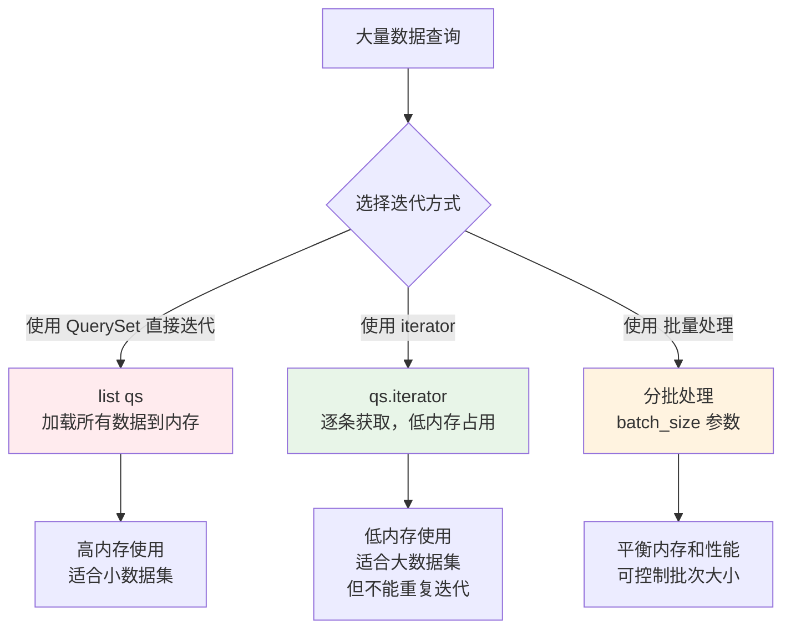
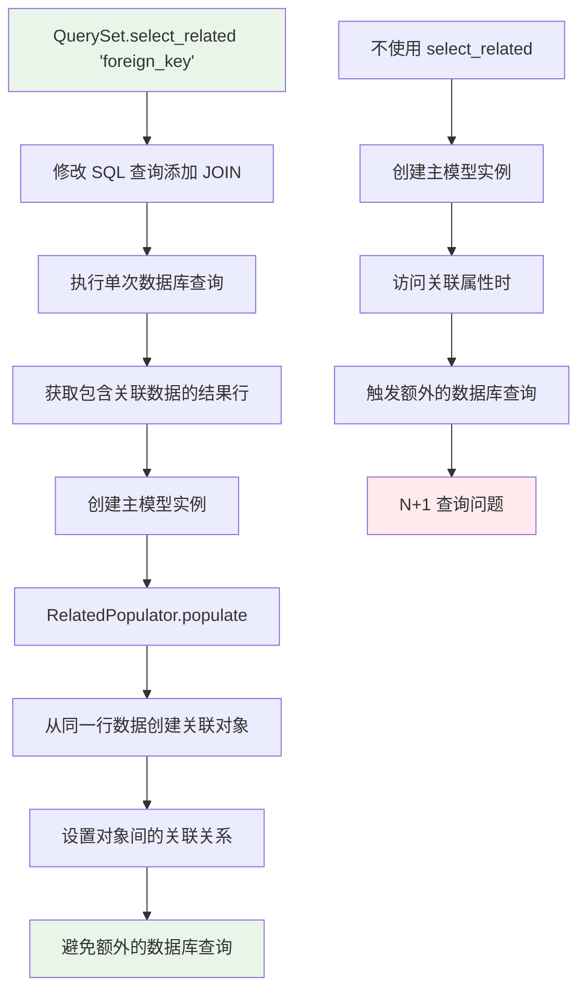

# Django QuerySet 源码阅读指南

## 1. 概述

Django QuerySet 是 Django ORM 的核心组件，实现了数据库查询的惰性加载机制。本文档基于 Django 1.11 版本的源码，深入分析 QuerySet 的实现原理。

### 1.1 文件位置
- 主要源码文件：`django/db/models/query.py`
- 核心类：`QuerySet`、`ModelIterable`、`RelatedPopulator`

### 1.2 设计目标
- **惰性求值**：只有在真正需要数据时才执行数据库查询
- **链式操作**：支持方法链调用，保持代码简洁
- **结果缓存**：避免重复的数据库查询
- **内存优化**：支持大数据集的高效处理

## 2. QuerySet 惰性加载机制

### 2.1 整体流程图



### 2.2 惰性加载的核心原理

惰性加载通过以下几个关键机制实现：

1. **延迟执行**：QuerySet 创建时不执行数据库查询
2. **结果缓存**：`_result_cache` 属性控制查询的执行和缓存
3. **触发机制**：特定操作触发实际的数据库查询

## 3. 核心类和方法分析

### 3.1 QuerySet 类初始化

```python
class QuerySet(object):
    def __init__(self, model=None, query=None, using=None, hints=None):
        self.model = model
        self._db = using
        self._hints = hints or {}
        self.query = query or sql.Query(self.model)
        self._result_cache = None  # 🔑 关键：结果缓存初始为 None
        self._sticky_filter = False
        self._for_write = False
        self._prefetch_related_lookups = ()
        self._prefetch_done = False
        self._known_related_objects = {}
        self._iterable_class = ModelIterable
        self._fields = None
```

**关键点分析**：
- `_result_cache = None`：这是惰性加载的核心，只有在真正需要数据时才会填充
- `query` 对象：封装了 SQL 查询逻辑，但不立即执行
- `_iterable_class`：定义了如何将数据库行转换为模型实例

### 3.2 链式操作机制



#### filter 方法实现

```python
def filter(self, *args, **kwargs):
    """返回新的 QuerySet 实例，不执行查询"""
    return self._filter_or_exclude(False, *args, **kwargs)

def _filter_or_exclude(self, negate, *args, **kwargs):
    clone = self._clone()  # 🔑 克隆当前 QuerySet
    if negate:
        clone.query.add_q(~Q(*args, **kwargs))
    else:
        clone.query.add_q(Q(*args, **kwargs))
    return clone  # 返回新的 QuerySet，仍然惰性
```

**设计要点**：
- 每个过滤操作都返回新的 QuerySet 对象
- 原始 QuerySet 保持不变（不可变性）
- 新 QuerySet 的 `_result_cache` 仍然为 `None`

### 3.3 触发求值的操作



#### 关键方法实现

```python
def __iter__(self):
    """迭代器协议实现"""
    self._fetch_all()  # 🔑 触发实际的数据库查询
    return iter(self._result_cache)

def __len__(self):
    """长度计算"""
    self._fetch_all()
    return len(self._result_cache)

def __bool__(self):
    """布尔值判断"""
    self._fetch_all()
    return bool(self._result_cache)

def __getitem__(self, k):
    """索引/切片访问"""
    if self._result_cache is not None:
        return self._result_cache[k]  # 如果已有缓存，直接返回
    
    # 切片操作：创建新 QuerySet 而不是执行查询
    if isinstance(k, slice):
        qs = self._clone()
        qs.query.set_limits(k.start, k.stop)
        return list(qs)[::k.step] if k.step else qs
    
    # 单个元素访问
    qs = self._clone()
    qs.query.set_limits(k, k + 1)
    return list(qs)[0]
```

### 3.4 _fetch_all 核心方法

```python
def _fetch_all(self):
    """惰性加载的核心实现"""
    if self._result_cache is None:  # 🔑 只有缓存为空时才执行查询
        self._result_cache = list(self._iterable_class(self))
    if self._prefetch_related_lookups and not self._prefetch_done:
        self._prefetch_related_objects()
```

#### 执行流程时序图



### 3.5 ModelIterable 类分析

```python
class ModelIterable(BaseIterable):
    """为每一行生成一个模型实例"""

    def __iter__(self):
        queryset = self.queryset
        db = queryset.db
        compiler = queryset.query.get_compiler(using=db)
        
        # 执行查询，这里才真正访问数据库
        results = compiler.execute_sql(chunked_fetch=self.chunked_fetch)
        
        # 获取选择字段、类信息等
        select, klass_info, annotation_col_map = (
            compiler.select, compiler.klass_info, compiler.annotation_col_map
        )
        model_cls = klass_info['model']
        select_fields = klass_info['select_fields']
        model_fields_start, model_fields_end = select_fields[0], select_fields[-1] + 1
        init_list = [f[0].target.attname
                     for f in select[model_fields_start:model_fields_end]]
        
        # 获取关联对象填充器
        related_populators = get_related_populators(klass_info, select, db)
        
        # 逐行处理结果，创建模型实例
        for row in compiler.results_iter(results):
            obj = model_cls.from_db(db, init_list, row[model_fields_start:model_fields_end])
            
            # 处理关联对象
            if related_populators:
                for rel_populator in related_populators:
                    rel_populator.populate(row, obj)
                    
            # 处理注解字段
            if annotation_col_map:
                for attr_name, col_pos in annotation_col_map.items():
                    setattr(obj, attr_name, row[col_pos])

            # 处理已知的关联对象
            if queryset._known_related_objects:
                for field, rel_objs in queryset._known_related_objects.items():
                    if hasattr(obj, field.get_cache_name()):
                        continue
                    pk = getattr(obj, field.get_attname())
                    try:
                        rel_obj = rel_objs[pk]
                    except KeyError:
                        pass
                    else:
                        setattr(obj, field.name, rel_obj)

            yield obj  # 🔑 生成器模式，逐个返回对象
```

**关键特性**：
- 使用生成器模式，内存效率高
- 支持分块获取数据（`chunked_fetch`）
- 自动处理关联对象和注解字段

## 4. 流程图详解

### 4.1 QuerySet 状态变化



### 4.2 内存使用优化策略



## 5. 性能优化机制

### 5.1 select_related 优化



#### RelatedPopulator 类实现

```python
class RelatedPopulator(object):
    """
    RelatedPopulator 用于 select_related 对象实例化。
    
    思路是每个 select_related 模型都由不同的 RelatedPopulator 实例填充。
    RelatedPopulator 实例获取 klass_info 和 select（在 SQLCompiler 中计算）
    以及使用的数据库作为初始化输入。
    """
    def __init__(self, klass_info, select, db):
        self.db = db
        # 预计算需要的属性
        select_fields = klass_info['select_fields']
        from_parent = klass_info['from_parent']
        
        if not from_parent:
            # 简单情况：字段顺序与 __init__ 期望的顺序相同
            self.cols_start = select_fields[0]
            self.cols_end = select_fields[-1] + 1
            self.init_list = [
                f[0].target.attname for f in select[self.cols_start:self.cols_end]
            ]
            self.reorder_for_init = None
        else:
            # 复杂情况：需要重新排序字段数据
            model_init_attnames = [
                f.attname for f in klass_info['model']._meta.concrete_fields
            ]
            reorder_map = []
            for idx in select_fields:
                field = select[idx][0].target
                init_pos = model_init_attnames.index(field.attname)
                reorder_map.append((init_pos, field.attname, idx))
            reorder_map.sort()
            self.init_list = [v[1] for v in reorder_map]
            pos_list = [row_pos for _, _, row_pos in reorder_map]

            def reorder_for_init(row):
                return [row[row_pos] for row_pos in pos_list]
            self.reorder_for_init = reorder_for_init

        self.model_cls = klass_info['model']
        self.pk_idx = self.init_list.index(self.model_cls._meta.pk.attname)
        self.related_populators = get_related_populators(klass_info, select, self.db)
        
        # 设置缓存名称
        field = klass_info['field']
        reverse = klass_info['reverse']
        self.reverse_cache_name = None
        if reverse:
            self.cache_name = field.remote_field.get_cache_name()
            self.reverse_cache_name = field.get_cache_name()
        else:
            self.cache_name = field.get_cache_name()
            if field.unique:
                self.reverse_cache_name = field.remote_field.get_cache_name()

    def populate(self, row, from_obj):
        """从数据库行填充关联对象"""
        if self.reorder_for_init:
            obj_data = self.reorder_for_init(row)
        else:
            obj_data = row[self.cols_start:self.cols_end]
            
        if obj_data[self.pk_idx] is None:
            obj = None
        else:
            obj = self.model_cls.from_db(self.db, self.init_list, obj_data)
            
        # 递归处理嵌套的关联对象
        if obj and self.related_populators:
            for rel_iter in self.related_populators:
                rel_iter.populate(row, obj)
                
        # 设置关联对象到主对象上
        setattr(from_obj, self.cache_name, obj)
        if obj and self.reverse_cache_name:
            setattr(obj, self.reverse_cache_name, from_obj)
```

### 5.2 prefetch_related 机制

prefetch_related 通过单独的查询来获取关联对象，然后在 Python 中进行关联：

```python
def prefetch_related_objects(model_instances, *related_lookups):
    """
    为模型实例列表填充预取的对象缓存，基于给定的查找/Prefetch 实例。
    """
    if len(model_instances) == 0:
        return  # 没有什么可做的

    related_lookups = normalize_prefetch_lookups(related_lookups)
    
    # 需要能够动态添加到我们查找的 prefetch_related 查找列表中
    done_queries = {}    # 类似 'foo__bar': [results] 的字典
    auto_lookups = set()  # 我们在进行过程中添加到这里
    followed_descriptors = set()  # 递归保护

    all_lookups = deque(related_lookups)
    while all_lookups:
        lookup = all_lookups.popleft()
        if lookup.prefetch_to in done_queries:
            if lookup.queryset:
                raise ValueError("'%s' lookup was already seen with a different queryset. "
                                 "You may need to adjust the ordering of your lookups." % lookup.prefetch_to)
            continue

        # 顶层，要装饰的对象列表是主 QuerySet 的结果缓存
        obj_list = model_instances
        
        # 处理查找路径的每个部分
        through_attrs = lookup.prefetch_through.split(LOOKUP_SEP)
        for level, through_attr in enumerate(through_attrs):
            # ... 复杂的预取逻辑
            pass
```

## 6. 实战案例分析

### 6.1 基础用法示例

```python
# 示例模型
class User(models.Model):
    name = models.CharField(max_length=100)
    age = models.IntegerField()

class Post(models.Model):
    title = models.CharField(max_length=200)
    author = models.ForeignKey(User, on_delete=models.CASCADE)

# 惰性加载示例
def lazy_loading_example():
    # 1. 创建 QuerySet - 惰性的，不执行查询
    qs = User.objects.filter(age__gt=18)
    print("QuerySet 已创建，但未执行查询")
    print(f"QuerySet._result_cache: {qs._result_cache}")  # None
    
    # 2. 链式操作 - 仍然惰性的
    qs = qs.filter(name__startswith='A').order_by('id')
    print("添加了更多过滤条件，仍未执行查询")
    print(f"QuerySet._result_cache: {qs._result_cache}")  # 仍然是 None
    
    # 3. 触发求值的操作
    print("现在开始执行查询...")
    
    # 方式1：迭代触发
    for user in qs:  # 这里触发 __iter__ -> _fetch_all
        print(f"User: {user.name}")
    print(f"QuerySet._result_cache: {qs._result_cache is not None}")  # True
    
    # 方式2：长度计算触发（使用缓存，不会重新查询）
    count = len(qs)  # 使用已缓存的结果
    print(f"Count: {count}")
    
    # 方式3：布尔值判断（使用缓存）
    if qs:  # 使用已缓存的结果
        print("有数据")
```

### 6.2 性能优化示例

```python
def optimization_examples():
    # ❌ N+1 查询问题
    posts = Post.objects.all()
    for post in posts:
        print(f"{post.title} by {post.author.name}")  # 每次都查询数据库
    
    # ✅ 使用 select_related 优化 实现原理就是把user和book进行inner join了
    posts = Post.objects.select_related('author').all()
    for post in posts:
        print(f"{post.title} by {post.author.name}")  # 只查询一次数据库
    
    # ✅ 大数据集的内存优化
    # 方式1：使用 iterator，低内存占用
    for user in User.objects.all().iterator():
        process_user(user)
    
    # 方式2：分批处理
    batch_size = 1000
    for user in User.objects.all().iterator(chunk_size=batch_size):
        process_user(user)
```

### 6.3 切片操作的惰性特性

```python
def slicing_examples():
    # 切片操作仍然保持惰性
    qs = User.objects.filter(age__gt=18)
    
    # 获取前10个用户 - 创建新的 QuerySet，添加 LIMIT 10
    first_10 = qs[:10]  # 仍然惰性，未执行查询
    print(f"first_10._result_cache: {first_10._result_cache}")  # None
    
    # 只有在实际使用时才执行查询
    users = list(first_10)  # 现在执行查询，SQL 包含 LIMIT 10
    
    # 获取单个用户
    first_user = qs[0]  # 创建 LIMIT 1 的查询并立即执行
```

## 7. 总结

### 7.1 核心设计原则

1. **惰性求值**：延迟执行直到真正需要数据
2. **不可变性**：QuerySet 操作返回新对象，保持原对象不变
3. **缓存机制**：避免重复的数据库查询
4. **内存效率**：支持大数据集的流式处理

### 7.2 关键技术点

- `_result_cache` 控制查询执行和结果缓存
- `_fetch_all` 是惰性加载的核心入口
- `ModelIterable` 使用生成器模式处理数据行
- `RelatedPopulator` 优化关联对象的加载
- 多层迭代器架构支持灵活的数据处理

### 7.3 性能优化建议

1. **合理使用 select_related**：避免 N+1 查询问题
2. **大数据集使用 iterator**：降低内存使用
3. **避免不必要的求值**：保持 QuerySet 的惰性特性
4. **重用 QuerySet 对象**：利用结果缓存机制

### 7.4 学习要点

- 理解惰性加载的触发时机
- 掌握 QuerySet 的状态变化过程
- 熟悉各种优化技术的使用场景
- 关注内存使用和查询效率的平衡

Django QuerySet 的设计是现代 ORM 框架的典型代表，通过巧妙的惰性加载机制，在提供简洁 API 的同时保证了良好的性能特性。深入理解其实现原理，有助于我们更好地使用 Django ORM，编写高效的数据库查询代码。
