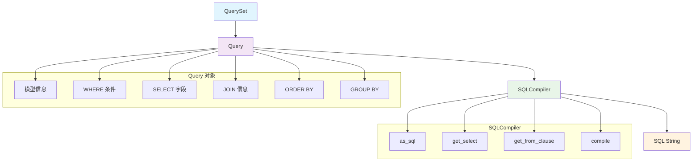
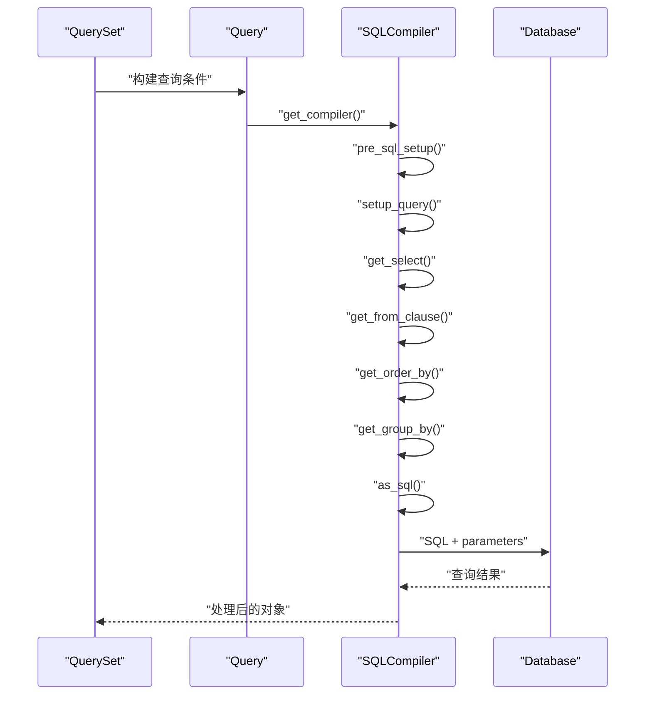
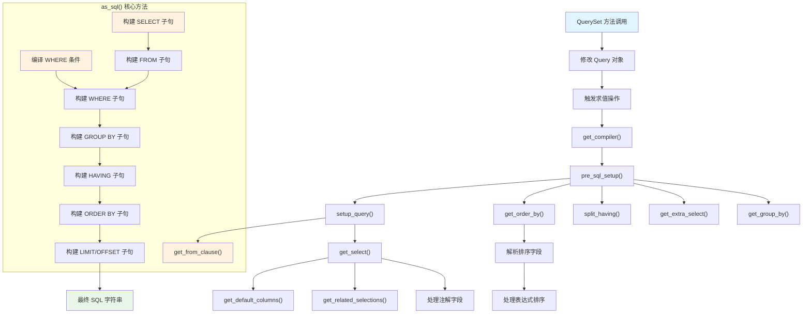
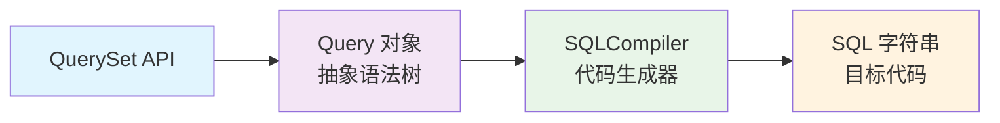

# Django SQL 查询构建与生成深度解析

## 目录
- [1. 概述](#1-概述)
- [2. 核心组件架构](#2-核心组件架构)
- [3. Query 类详解](#3-query-类详解)
- [4. SQLCompiler 编译器](#4-sqlcompiler-编译器)
- [5. SQL 生成流程](#5-sql-生成流程)
- [6. 关键数据结构](#6-关键数据结构)
- [7. 实战案例分析](#7-实战案例分析)
- [8. 高级特性](#8-高级特性)
- [9. 查询优化策略](#9-查询优化策略)
- [10. 性能监控与调试](#10-性能监控与调试)
- [11. 最佳实践](#11-最佳实践)
- [12. 总结](#12-总结)

## 1. 概述

Django ORM 的 SQL 查询构建是一个复杂而精巧的系统，它将 Python 对象和方法调用转换为高效的 SQL 查询。这个系统的核心在于将面向对象的查询 API 抽象为底层的 SQL 语句。

### 1.1 文件结构
```
django/db/models/sql/
├── __init__.py          # 模块入口
├── constants.py         # SQL 相关常量
├── query.py            # Query 类 - 查询抽象
├── compiler.py         # SQLCompiler - SQL 编译器
├── datastructures.py   # 数据结构定义
├── where.py            # WHERE 子句处理
└── subqueries.py       # 子查询处理
```

### 1.2 核心设计原则

1. **抽象分离**：查询逻辑与 SQL 生成分离
2. **延迟计算**：只有在需要时才生成 SQL
3. **多数据库支持**：通过编译器适配不同数据库
4. **性能优化**：智能的 JOIN 和查询优化

## 2. 核心组件架构



## 3. Query 类详解

### 3.1 Query 类的核心属性

根据源码分析，Query 类是 SQL 查询的抽象表示：

```python
class Query(object):
    """单个 SQL 查询的抽象表示"""
    
    def __init__(self, model, where=WhereNode):
        # 模型相关
        self.model = model
        
        # 表别名管理
        self.alias_refcount = {}     # 别名引用计数
        self.alias_map = {}          # 别名映射 - 最重要的 JOIN 数据结构
        self.table_map = {}          # 表名到别名的映射
        self.tables = []             # 按创建顺序的别名列表
        
        # SELECT 相关
        self.select = []             # SELECT 子句的表达式
        self.default_cols = True     # 是否使用默认列
        self.values_select = []      # values() 调用选择的字段
        
        # WHERE 相关
        self.where = where()         # WHERE 条件树
        self.where_class = where     # WHERE 节点类型
        
        # ORDER BY 相关
        self.order_by = []           # 排序字段列表
        self.default_ordering = True # 是否使用默认排序
        self.standard_ordering = True # 标准排序方向
        
        # GROUP BY 相关
        self.group_by = None         # 分组字段
        
        # LIMIT/OFFSET 相关
        self.low_mark, self.high_mark = 0, None
        
        # 高级特性
        self.select_related = False  # 是否预加载关联对象
        self.distinct = False        # 是否去重
        self.select_for_update = False # 是否加锁查询
        
        # 注解和额外字段
        self._annotations = None     # 注解表达式
        self._extra = None          # 额外的 SQL 片段
```

**关键点分析**：
- `alias_map` 是 JOIN 管理的核心数据结构
- `where` 使用树形结构表示复杂的条件逻辑
- 各种标志位控制 SQL 生成的不同方面

### 3.2 重要方法分析

#### 添加过滤条件
```python
def add_q(self, q_object):
    """添加 Q 对象到查询中"""
    # 将 Q 对象解析为 WHERE 条件
    clause, _ = self._add_q(q_object, self.used_aliases)
    if clause:
        self.where.add(clause, AND)
```

#### 添加关联查询
```python
def add_select_related(self, fields):
    """添加 select_related 字段"""
    # 设置预加载标志
    field_dict = {}
    for field in fields:
        d = field_dict
        for part in field.split(LOOKUP_SEP):
            d = d.setdefault(part, {})
    self.select_related = field_dict
```

## 4. SQLCompiler 编译器

### 4.1 编译器的作用

SQLCompiler 是将 Query 对象转换为实际 SQL 字符串的核心组件：

```python
class SQLCompiler(object):
    def __init__(self, query, connection, using):
        self.query = query           # Query 对象
        self.connection = connection # 数据库连接
        self.using = using          # 数据库别名
        self.quote_cache = {}       # 引用缓存
        
        # 这些属性在查询执行时设置
        self.select = None          # 编译后的 SELECT 字段
        self.klass_info = None      # 类信息（用于对象创建）
        self.annotation_col_map = None # 注解列映射
```

### 4.2 SQL 生成的核心流程



### 4.3 as_sql 方法详解

这是生成最终 SQL 的核心方法：

```python
def as_sql(self, with_limits=True, with_col_aliases=False):
    """创建查询的 SQL，返回 SQL 字符串和参数列表"""
    
    # 1. 准备工作
    refcounts_before = self.query.alias_refcount.copy()
    try:
        extra_select, order_by, group_by = self.pre_sql_setup()
        distinct_fields = self.get_distinct()
        
        # 2. 构建 FROM 子句（必须在 select, ordering, distinct 之后）
        from_, f_params = self.get_from_clause()
        
        # 3. 编译 WHERE 和 HAVING 子句
        where, w_params = self.compile(self.where) if self.where is not None else ("", [])
        having, h_params = self.compile(self.having) if self.having is not None else ("", [])
        
        # 4. 处理集合操作（UNION, INTERSECT 等）
        combinator = self.query.combinator
        if combinator:
            return self.get_combinator_sql(combinator, self.query.combinator_all)
        
        # 5. 构建基本查询结构
        result = ['SELECT']
        params = []
        
        # 6. 处理 DISTINCT
        if self.query.distinct:
            result.append(self.connection.ops.distinct_sql(distinct_fields))
        
        # 7. 构建 SELECT 子句
        out_cols = []
        col_idx = 1
        for _, (s_sql, s_params), alias in self.select + extra_select:
            if alias:
                s_sql = '%s AS %s' % (s_sql, self.connection.ops.quote_name(alias))
            elif with_col_aliases:
                s_sql = '%s AS %s' % (s_sql, 'Col%d' % col_idx)
                col_idx += 1
            params.extend(s_params)
            out_cols.append(s_sql)
        
        result.append(', '.join(out_cols))
        
        # 8. 添加 FROM 子句
        result.append('FROM')
        result.extend(from_)
        params.extend(f_params)
        
        # 9. 添加 WHERE 子句
        if where:
            result.append('WHERE %s' % where)
            params.extend(w_params)
        
        # 10. 添加 GROUP BY 子句
        grouping = []
        for g_sql, g_params in group_by:
            grouping.append(g_sql)
            params.extend(g_params)
        if grouping:
            result.append('GROUP BY %s' % ', '.join(grouping))
        
        # 11. 添加 HAVING 子句
        if having:
            result.append('HAVING %s' % having)
            params.extend(h_params)
        
        # 12. 添加 ORDER BY 子句
        if order_by:
            ordering = []
            for _, (o_sql, o_params, _) in order_by:
                ordering.append(o_sql)
                params.extend(o_params)
            result.append('ORDER BY %s' % ', '.join(ordering))
        
        # 13. 添加 LIMIT/OFFSET 子句
        if with_limits:
            if self.query.high_mark is not None:
                result.append('LIMIT %d' % (self.query.high_mark - self.query.low_mark))
            if self.query.low_mark:
                if self.query.high_mark is None:
                    val = self.connection.ops.no_limit_value()
                    if val:
                        result.append('LIMIT %d' % val)
                result.append('OFFSET %d' % self.query.low_mark)
        
        return ' '.join(result), tuple(params)
    
    finally:
        # 清理工作 - 清除创建的 JOIN
        self.query.reset_refcounts(refcounts_before)
```

## 5. SQL 生成流程

### 5.1 完整的 SQL 生成流程图



### 5.2 关键步骤详解

#### 步骤1：setup_query()
```python
def setup_query(self):
    """设置查询的基本信息"""
    # 确保至少有一个表别名
    if all(self.query.alias_refcount[a] == 0 for a in self.query.tables):
        self.query.get_initial_alias()
    
    # 获取 SELECT 子句信息
    self.select, self.klass_info, self.annotation_col_map = self.get_select()
    self.col_count = len(self.select)
```

#### 步骤2：get_select()
```python
def get_select(self):
    """构建 SELECT 子句的字段列表"""
    select = []
    klass_info = None
    annotations = {}
    select_idx = 0
    
    # 处理 extra_select
    for alias, (sql, params) in self.query.extra_select.items():
        select.append((RawSQL(sql, params), alias))
        select_idx += 1
    
    # 处理默认列（模型的所有字段）
    if self.query.default_cols:
        select_list = []
        for c in self.get_default_columns():
            select_list.append(select_idx)
            select.append((c, None))
            select_idx += 1
        klass_info = {
            'model': self.query.model,
            'select_fields': select_list,
        }
    
    # 处理 select_related
    if self.query.select_related:
        related_klass_infos = self.get_related_selections(select)
        klass_info['related_klass_infos'] = related_klass_infos
    
    return select, klass_info, annotations
```

## 6. 关键数据结构

### 6.1 alias_map 结构

`alias_map` 是管理表连接的核心数据结构：

```python
# alias_map 的结构
{
    'table_alias': Join(
        table_name='actual_table_name',
        parent_alias='parent_table_alias',
        table_alias='current_alias',
        join_type=INNER,  # 或 LOUTER
        join_field=field_object,
        nullable=True/False
    )
}

# 例子：User.objects.select_related('profile')
{
    'auth_user': BaseTable('auth_user', 'auth_user'),
    'auth_user__profile': Join(
        table_name='user_profile',
        parent_alias='auth_user', 
        table_alias='auth_user__profile',
        join_type=LOUTER,
        join_field=profile_field,
        nullable=True
    )
}
```

### 6.2 WHERE 条件树

WHERE 条件使用树形结构表示：

```python
class WhereNode(Node):
    """WHERE 条件的树节点"""
    
    def __init__(self):
        super(WhereNode, self).__init__()
        self.connector = AND  # 连接符：AND 或 OR
        
    def add(self, data, conn_type):
        """添加条件到树中"""
        if data:
            if self.connector == conn_type:
                # 相同连接符，直接添加
                if isinstance(data, Node) and not data.negated:
                    self.children.extend(data.children)
                else:
                    self.children.append(data)
            else:
                # 不同连接符，创建新的子树
                obj = self.__class__()
                obj.connector = conn_type
                obj.children.append(data)
                self.children.append(obj)

# 例子：User.objects.filter(age__gt=18, name__startswith='A')
# 生成的树结构：
WhereNode(connector=AND, children=[
    Lookup(field='age', lookup='gt', value=18),
    Lookup(field='name', lookup='startswith', value='A')
])
```

## 7. 实战案例分析

### 7.1 简单查询的构建过程

```python
# 原始查询
User.objects.filter(age__gt=18).order_by('name')
```

**步骤分析**：

1. **创建 Query 对象**
```python
query = Query(User)
# query.model = User
# query.alias_map = {}
# query.where = WhereNode()
```

2. **添加过滤条件**
```python
# filter(age__gt=18) 调用
lookup = Lookup(field='age', lookup='gt', value=18)
query.where.add(lookup, AND)
```

3. **添加排序**
```python
# order_by('name') 调用  
query.order_by = ['name']
```

4. **生成 SQL**
```python
compiler = query.get_compiler('default')
sql, params = compiler.as_sql()
# 结果: "SELECT ... FROM auth_user WHERE age > %s ORDER BY name", [18]
```

### 7.2 复杂关联查询

```python
# 复杂查询
Post.objects.select_related('author', 'category').filter(
    author__age__gt=25,
    category__name='Tech'
).order_by('-created_at')
```

**构建过程**：

1. **处理 select_related**
```python
# 在 alias_map 中添加 JOIN 信息
query.alias_map = {
    'blog_post': BaseTable('blog_post', 'blog_post'),
    'blog_post__author': Join(
        table_name='auth_user',
        parent_alias='blog_post',
        table_alias='blog_post__author',
        join_type=INNER,
        join_cols=[('blog_post', 'author_id', 'id')]
    ),
    'blog_post__category': Join(
        table_name='blog_category', 
        parent_alias='blog_post',
        table_alias='blog_post__category',
        join_type=INNER,
        join_cols=[('blog_post', 'category_id', 'id')]
    )
}
```

2. **处理 WHERE 条件**
```python
query.where = WhereNode(connector=AND, children=[
    Lookup(field='blog_post__author__age', lookup='gt', value=25),
    Lookup(field='blog_post__category__name', lookup='exact', value='Tech')
])
```

3. **生成的 SQL**
```sql
SELECT 
    blog_post.id, blog_post.title, blog_post.author_id, blog_post.category_id,
    auth_user.id, auth_user.name, auth_user.age,
    blog_category.id, blog_category.name
FROM blog_post 
INNER JOIN auth_user ON (blog_post.author_id = auth_user.id)
INNER JOIN blog_category ON (blog_post.category_id = blog_category.id)
WHERE auth_user.age > %s AND blog_category.name = %s
ORDER BY blog_post.created_at DESC
```

### 7.3 聚合查询的处理

```python
# 聚合查询
User.objects.values('department').annotate(
    count=Count('id'),
    avg_age=Avg('age')
).filter(count__gt=5)
```

**构建过程**：

1. **处理 values() 调用**
```python
query.values_select = ['department']
query.default_cols = False
```

2. **处理 annotate() 调用**
```python
query.annotations = OrderedDict([
    ('count', Count('id')),
    ('avg_age', Avg('age'))
])
query.group_by = True  # 按 values_select 分组
```

3. **处理 HAVING 条件**
```python
# filter(count__gt=5) 被识别为 HAVING 条件
having_lookup = Lookup(field='count', lookup='gt', value=5)
query.having.add(having_lookup, AND)
```

4. **生成的 SQL**
```sql
SELECT 
    auth_user.department,
    COUNT(auth_user.id) AS count,
    AVG(auth_user.age) AS avg_age
FROM auth_user
GROUP BY auth_user.department
HAVING COUNT(auth_user.id) > %s
```

## 8. 高级特性

### 8.1 子查询处理

Django 支持多种类型的子查询：

```python
# 标量子查询
newest_posts = Post.objects.filter(
    author=OuterRef('pk')
).order_by('-created_at')

authors_with_recent_posts = Author.objects.annotate(
    newest_post_title=Subquery(newest_posts.values('title')[:1])
)
```

**实现机制**：
- 使用 `Subquery` 表达式包装内部查询
- 编译时递归调用 `as_sql()` 方法
- 正确处理外部引用 (`OuterRef`)

### 8.2 集合操作

```python
# UNION 查询
recent_posts = Post.objects.filter(created_at__gte=recent_date)
popular_posts = Post.objects.filter(views__gte=1000)
combined = recent_posts.union(popular_posts)
```

**实现机制**：
```python
def get_combinator_sql(self, combinator, all):
    """处理集合操作的 SQL 生成"""
    compilers = [
        query.get_compiler(self.using, self.connection)
        for query in self.query.combined_queries
    ]
    parts = (compiler.as_sql() for compiler in compilers)
    combinator_sql = self.connection.ops.set_operators[combinator]
    sql_parts, args_parts = zip(*parts)
    result = ' {} '.format(combinator_sql).join(sql_parts)
    return result, combined_params
```

### 8.3 原始 SQL 支持

```python
# 使用原始 SQL
users = User.objects.extra(
    select={'full_name': "first_name || ' ' || last_name"},
    where=["age > %s"],
    params=[18]
)
```

**实现机制**：
- `extra_select` 直接插入到 SELECT 子句
- `extra_where` 使用 `ExtraWhere` 节点
- 参数通过 `params` 传递

## 9. 查询优化策略

### 9.1 基础优化技巧

#### 1. 字段选择优化

```python
# ❌ 避免：选择所有字段
User.objects.all()

# ✅ 推荐：只选择需要的字段
User.objects.only('name', 'email')
User.objects.values('name', 'email')
User.objects.values_list('name', 'email')

# ✅ 推荐：延迟加载不常用字段
User.objects.defer('bio', 'avatar')
```

#### 2. 关联查询优化

```python
# ❌ 避免：N+1 查询问题
posts = Post.objects.all()
for post in posts:
    print(post.author.name)  # 每次都查询数据库

# ✅ 推荐：使用 select_related (ForeignKey, OneToOne)
posts = Post.objects.select_related('author', 'category')
for post in posts:
    print(post.author.name)  # 只查询一次数据库

# ✅ 推荐：使用 prefetch_related (ManyToMany, 反向ForeignKey)
authors = Author.objects.prefetch_related('posts')
for author in authors:
    for post in author.posts.all():
        print(post.title)
```

#### 3. 查询条件优化

```python
# ✅ 推荐：使用数据库索引字段进行过滤
User.objects.filter(email='user@example.com')  # email 字段有索引

# ✅ 推荐：使用 exists() 检查存在性
if User.objects.filter(email='user@example.com').exists():
    pass

# ❌ 避免：使用 len() 或 count() 检查存在性
if len(User.objects.filter(email='user@example.com')) > 0:
    pass
```

### 9.2 高级优化策略

#### 1. 批量操作优化

```python
# ✅ 推荐：使用 bulk_create
users = [User(name=f'User{i}') for i in range(1000)]
User.objects.bulk_create(users, batch_size=100)

# ✅ 推荐：使用 bulk_update
users = User.objects.filter(department='IT')
for user in users:
    user.salary *= 1.1
User.objects.bulk_update(users, ['salary'], batch_size=100)

# ✅ 推荐：使用 update() 进行批量更新
User.objects.filter(department='IT').update(salary=F('salary') * 1.1)

# ✅ 推荐：使用 delete() 进行批量删除
User.objects.filter(is_active=False).delete()
```

#### 2. 内存使用优化

```python
# ✅ 推荐：使用 iterator() 处理大数据集
for user in User.objects.all().iterator(chunk_size=1000):
    process_user(user)

# ✅ 推荐：使用 values() 减少内存占用
for user_data in User.objects.values('id', 'name').iterator():
    process_user_data(user_data)

# ✅ 推荐：分页处理大量数据
def process_users_in_batches(batch_size=1000):
    users = User.objects.all()
    for i in range(0, users.count(), batch_size):
        batch = users[i:i + batch_size]
        for user in batch:
            process_user(user)
```

#### 3. 查询缓存优化

```python
# ✅ 推荐：重用 QuerySet 以利用缓存
users = User.objects.filter(is_active=True)
print(len(users))  # 执行查询并缓存
print(bool(users))  # 使用缓存

# ✅ 推荐：使用 prefetch_related 的 Prefetch 对象自定义预取
from django.db.models import Prefetch

authors = Author.objects.prefetch_related(
    Prefetch(
        'posts',
        queryset=Post.objects.select_related('category').filter(is_published=True),
        to_attr='published_posts'
    )
)
```

#### 4. 数据库级别优化

```python
# ✅ 推荐：使用 select_for_update 避免并发问题
with transaction.atomic():
    user = User.objects.select_for_update().get(pk=user_id)
    user.balance -= amount
    user.save()

# ✅ 推荐：使用 raw SQL 处理复杂查询
users = User.objects.raw("""
    SELECT u.*, COUNT(p.id) as post_count
    FROM auth_user u
    LEFT JOIN blog_post p ON u.id = p.author_id
    GROUP BY u.id
    HAVING COUNT(p.id) > %s
""", [5])

# ✅ 推荐：使用数据库函数
from django.db.models import F, Value
from django.db.models.functions import Concat

User.objects.annotate(
    full_name=Concat('first_name', Value(' '), 'last_name')
)
```

### 9.3 查询性能分析

#### 1. 使用 explain() 分析查询计划

```python
# Django 2.1+ 支持
queryset = User.objects.filter(age__gt=25).select_related('profile')
print(queryset.explain())

# 更详细的分析
print(queryset.explain(options={'ANALYZE': True, 'VERBOSE': True}))
```

#### 2. 使用 Django Debug Toolbar

```python
# settings.py
if DEBUG:
    INSTALLED_APPS += ['debug_toolbar']
    MIDDLEWARE += ['debug_toolbar.middleware.DebugToolbarMiddleware']
    INTERNAL_IPS = ['127.0.0.1']
```

#### 3. 自定义查询分析器

```python
import time
from django.db import connection
from django.core.management.base import BaseCommand

class QueryAnalyzer:
    def __init__(self):
        self.queries = []
        
    def __enter__(self):
        self.initial_queries = len(connection.queries)
        self.start_time = time.time()
        return self
        
    def __exit__(self, exc_type, exc_val, exc_tb):
        self.end_time = time.time()
        self.queries = connection.queries[self.initial_queries:]
        
    def report(self):
        print(f"执行了 {len(self.queries)} 个查询")
        print(f"总时间: {self.end_time - self.start_time:.4f}s")
        
        for i, query in enumerate(self.queries, 1):
            print(f"查询 {i}: {query['time']}s")
            print(f"SQL: {query['sql']}")
            print("-" * 50)

# 使用示例
with QueryAnalyzer() as analyzer:
    users = list(User.objects.select_related('profile').all())
    
analyzer.report()
```

### 9.4 常见反模式及解决方案

#### 1. 避免在循环中查询

```python
# ❌ 反模式：在循环中查询
posts = Post.objects.all()
for post in posts:
    author = User.objects.get(id=post.author_id)  # N+1 查询
    print(f"{post.title} by {author.name}")

# ✅ 解决方案：使用 select_related
posts = Post.objects.select_related('author').all()
for post in posts:
    print(f"{post.title} by {post.author.name}")
```

#### 2. 避免重复查询

```python
# ❌ 反模式：重复查询
active_users = User.objects.filter(is_active=True)
user_count = User.objects.filter(is_active=True).count()  # 重复查询
user_list = User.objects.filter(is_active=True).all()     # 重复查询

# ✅ 解决方案：重用 QuerySet
active_users = User.objects.filter(is_active=True)
user_count = active_users.count()
user_list = list(active_users)  # 缓存结果
```

#### 3. 避免不必要的排序

```python
# ❌ 反模式：不必要的排序
users = User.objects.all().order_by('name')
user_count = users.count()  # count() 不需要排序

# ✅ 解决方案：在需要时才排序
users = User.objects.all()
user_count = users.count()
sorted_users = users.order_by('name')
```

### 9.5 数据库特定优化

#### 1. PostgreSQL 优化

```python
# 使用 PostgreSQL 特定功能
from django.contrib.postgres.search import SearchVector, SearchQuery
from django.contrib.postgres.aggregates import ArrayAgg

# 全文搜索
Post.objects.annotate(
    search=SearchVector('title', 'content')
).filter(search=SearchQuery('django'))

# 数组聚合
authors = Author.objects.annotate(
    post_titles=ArrayAgg('posts__title', distinct=True)
)
```

#### 2. MySQL 优化

```python
# 使用 MySQL 特定功能
# 强制使用特定索引
User.objects.extra(
    select={'force_index': 'USE INDEX (idx_email)'}
).filter(email__startswith='admin')
```

## 10. 性能监控与调试

### 10.1 SQL 日志配置

```python
# settings.py
LOGGING = {
    'version': 1,
    'disable_existing_loggers': False,
    'handlers': {
        'console': {
            'class': 'logging.StreamHandler',
        },
        'file': {
            'class': 'logging.FileHandler',
            'filename': 'sql.log',
        },
    },
    'loggers': {
        'django.db.backends': {
            'handlers': ['console', 'file'],
            'level': 'DEBUG',
            'propagate': False,
        },
    },
}
```

### 10.2 自定义中间件监控

```python
import time
from django.db import connection

class SQLQueryCountMiddleware:
    def __init__(self, get_response):
        self.get_response = get_response

    def __call__(self, request):
        initial_queries = len(connection.queries)
        start_time = time.time()
        
        response = self.get_response(request)
        
        end_time = time.time()
        query_count = len(connection.queries) - initial_queries
        
        if query_count > 10:  # 查询数量阈值
            print(f"警告: {request.path} 执行了 {query_count} 个查询")
            
        response['X-Query-Count'] = str(query_count)
        response['X-Query-Time'] = f"{end_time - start_time:.4f}"
        
        return response
```

### 10.3 查询性能测试

```python
import pytest
from django.test import TestCase
from django.test.utils import override_settings
from django.db import connection

class QueryPerformanceTest(TestCase):
    def test_user_list_query_count(self):
        """测试用户列表页面的查询数量"""
        # 创建测试数据
        users = [User(name=f'User{i}') for i in range(10)]
        User.objects.bulk_create(users)
        
        with self.assertNumQueries(1):
            list(User.objects.all())
            
    def test_post_with_author_query_count(self):
        """测试带作者信息的文章查询"""
        author = User.objects.create(name='Author')
        posts = [Post(title=f'Post{i}', author=author) for i in range(5)]
        Post.objects.bulk_create(posts)
        
        # 使用 select_related 应该只有 1 个查询
        with self.assertNumQueries(1):
            posts_with_authors = Post.objects.select_related('author').all()
            for post in posts_with_authors:
                _ = post.author.name  # 触发访问，但不应该产生额外查询
```

## 11. 最佳实践

### 11.1 查询设计原则

1. **最小化数据传输**：只查询需要的字段和记录
2. **减少查询次数**：使用 select_related 和 prefetch_related
3. **利用数据库特性**：使用索引、存储过程、视图等
4. **合理使用缓存**：QuerySet 缓存、Redis、Memcached
5. **监控和优化**：定期分析慢查询，优化瓶颈

### 11.2 代码组织建议

```python
# models.py - 在模型中定义常用查询
class UserManager(models.Manager):
    def active(self):
        return self.filter(is_active=True)
    
    def with_posts(self):
        return self.select_related().prefetch_related('posts')

class User(models.Model):
    name = models.CharField(max_length=100)
    is_active = models.BooleanField(default=True)
    
    objects = UserManager()

# views.py - 在视图中使用优化的查询
def user_list(request):
    users = User.objects.active().with_posts()
    return render(request, 'user_list.html', {'users': users})
```

### 11.3 性能检查清单

- [ ] 是否使用了合适的 select_related 和 prefetch_related
- [ ] 是否避免了 N+1 查询问题
- [ ] 是否只查询需要的字段
- [ ] 是否为常用查询条件创建了索引
- [ ] 是否使用了批量操作而不是循环操作
- [ ] 是否正确处理了大数据集（使用 iterator）
- [ ] 是否监控了查询性能（慢查询日志）
- [ ] 是否在必要时使用了原始 SQL

## 12. 总结

### 12.1 核心架构回顾

Django SQL 查询系统采用了经典的编译器设计模式：



### 12.2 关键设计特点

1. **分层抽象**
   - QuerySet: 用户接口层
   - Query: 查询抽象层
   - Compiler: SQL 生成层

2. **延迟计算**
   - 查询构建不立即生成 SQL
   - 只在需要时才编译执行

3. **数据库无关性**
   - 通过不同的 Compiler 支持多数据库
   - 数据库特定的 SQL 方言处理

4. **优化机制**
   - 智能的 JOIN 处理
   - 查询合并和优化
   - 结果缓存

### 12.3 学习要点

- **理解核心数据流**：QuerySet → Query → SQLCompiler → SQL
- **掌握关键数据结构**：alias_map, WHERE 树, select 列表
- **熟悉编译过程**：pre_sql_setup, as_sql 的各个步骤
- **实践性能优化**：合理使用各种查询技巧

### 12.4 性能优化总结

1. **查询优化**：
   - 使用 select_related 和 prefetch_related 减少查询次数
   - 使用 only() 和 defer() 控制字段选择
   - 使用 exists() 检查存在性而不是 count()

2. **批量操作**：
   - 使用 bulk_create, bulk_update, update(), delete()
   - 避免在循环中执行数据库操作

3. **内存优化**：
   - 使用 iterator() 处理大数据集
   - 使用 values() 减少对象创建开销

4. **监控调试**：
   - 使用 Django Debug Toolbar
   - 配置 SQL 日志记录
   - 编写性能测试用例

Django 的 SQL 构建系统是一个精巧的工程，它成功地将复杂的 SQL 生成逻辑隐藏在简洁的 Python API 之后，为开发者提供了强大而易用的数据库操作能力。通过深入理解这个系统的工作原理和掌握各种优化技巧，我们可以编写出高性能的 Django 应用程序。

### 12.5 进阶学习建议

1. **源码调试**：使用 debugger 跟踪完整的查询构建过程
2. **性能分析**：使用各种工具分析查询性能瓶颈
3. **扩展开发**：尝试实现自定义的 Lookup 和 Expression
4. **数据库优化**：学习数据库特定的优化技术

记住，性能优化是一个持续的过程，需要根据具体的应用场景和数据规模来选择合适的优化策略。始终要先测量，再优化，避免过早优化带来的复杂性。